# Introduction

Crime rates in neighborhoods are an important factor in finding a new home or allocating resources to better improve the affected neighborhood. For this assignment, our group are going to explore, analyze and model a data set containing information on crime for various neighborhoods of a major city and later going to use binary logistic regression to predict whether the neighborhood will be at risk for high crime levels. A binary logistic regression is a statistic method that models the relation between a binary dependent variable and a set of independent variables. It is widely used to determine dichotomous outcomes. 

In this assignment, our group explored the training data set for better understanding. We later prepared the data based on the insight and produced 3 different training data sets. After that, we evaluated all binary models and determined the best model that offers the best accuracy and completeness.

# Data Exploration

*Describe the size and the variables in the crime training data set. Consider that too much detail will cause a manager to lose interest while too little detail will make the manager consider that you aren't doing your job.*

A simple exploratory data analysis will be conducted and the training data provided will be used to determine the property and value of the dataset. The `DataExplorer` package will be used to provide a full profile for the data frame.

### Data Set

With the data set given, there are 466 rows, 13 columns and 6058 observations. There is no missing values or observations and all columns have continuous values. The `chas` variable is the only dummy variable out of 13 columns and is used to determine if the suburb borders the Charles River. Based on the histograms (Figure 2), both `rm` and `medv` variables are normally distributed, while other variables are skewed. Both tax and rad variables have a large proportion of outliers. Specifically, 121 of the 466 total observations have the same values that appear outside the normal range of each variable. The value `666` is used for `tax` and `24` for `rad`. We suspect these values may be constant placeholders, indicating a potential data quality issue. We decided not to create new variables because there is not enough relevant information in the data set to suggest new variables might be needed.


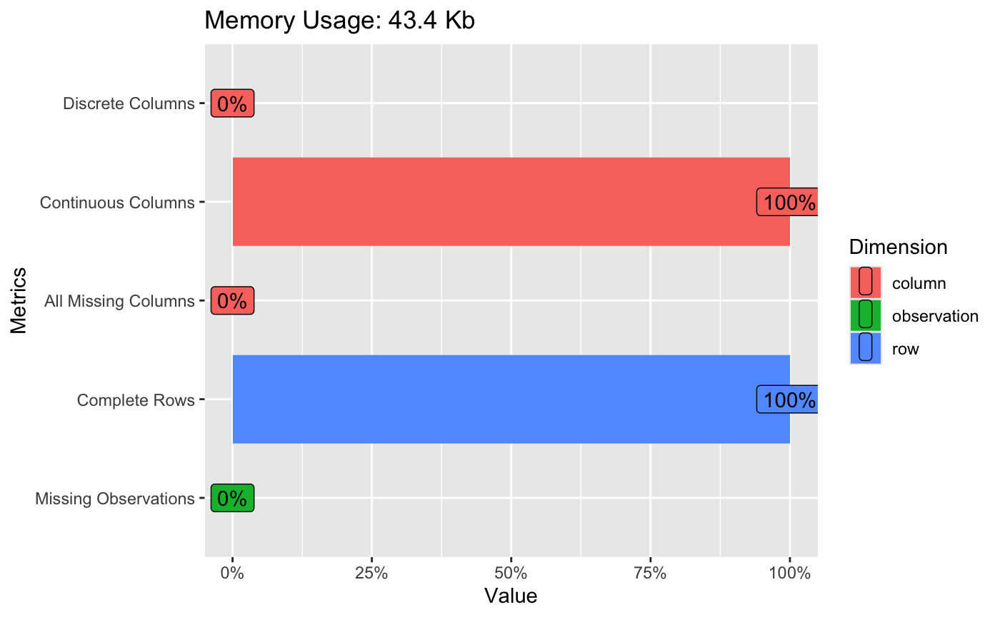


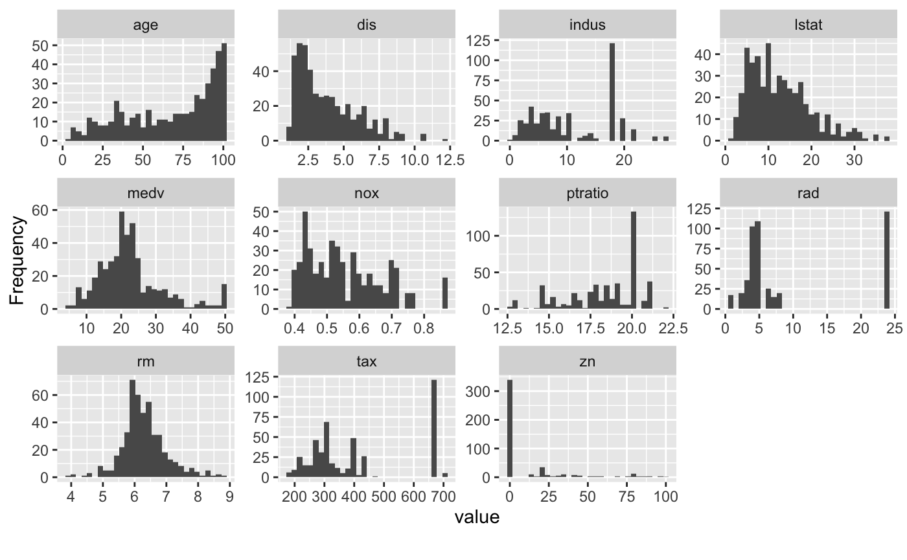

The box plots (Figure 3) highlight the median of each variable when divided into subsets according to the target variable's two classes. The plot demonstrate that, for most variables, there is a clear difference in the median values across each class. This would indicate that these variables are likely to provide meaningful signal in predicting the target label. 


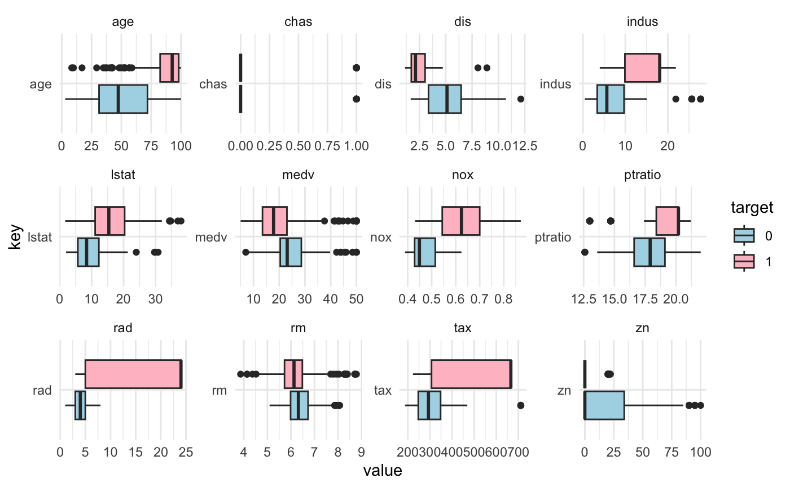


Based on the correlation plot (Figure 4), it shows that `rad` and `dis` have the highest positive correlation compared to other variables.


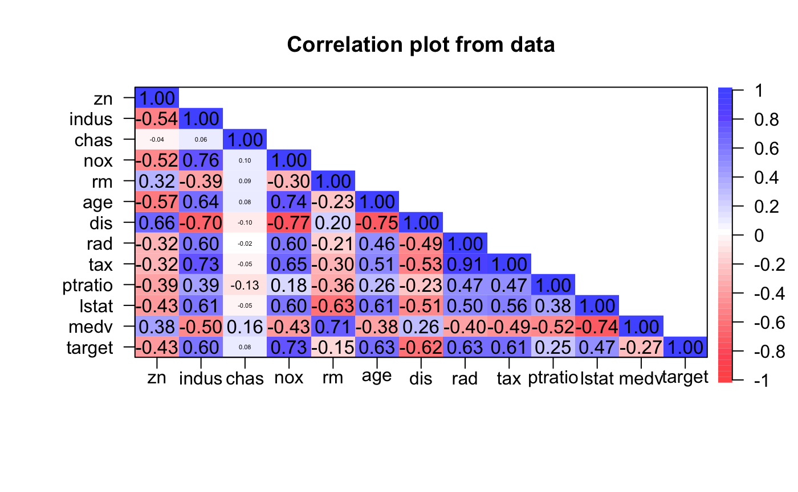


To determine if the dataset is compatible with the binary logistic regression model, the model is fitted and the VIF score analysis is conducted to check for any multicollinearity. After the model fitting, the P-value of the F-statistic is less than 0.05, showing that predictor variables may be significantly associated with the outcome. There are variables in the data set with moderate correlation between predictor variables. Both `rad` and `tax` variables have the highest VIF scores (Figure 5) and it is over 5, showing that they are severely correlated with other predictor variables. Therefore, either variable need to removed and need to reevaluated before modeling the binary regression model.


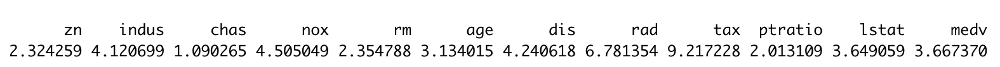

With either `rad` or `tax` variables removed from the data set, the updated data set is reevaluated and with the updated VIF scores, both variable score dropped below 5 and it appears that `tax` variable have a bigger impact (Figure 6) than `rad` variable (Figure 5). Therefore, the data set with `tax` removed will be selected for the model building.


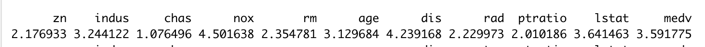


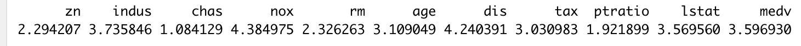


# Data Preparation

*Describe how you have transformed the data by changing the original variables or creating new variables. If you did transform the data or create new variables, discuss why you did this.*

Based on the outcome from our data exploratory analysis, some of the variables are identified to be skewed, so log transformations are needed to address the issue. Log transformations are applied on these variables: `lstat`, `age`, `indus`, `tax`, `rad` and `dis`. This method can reduce the skewness of the data and diminish the impact of outliers in variables such as `indus`, `tax`, and `rad` since they have a large population of outliers. With the log transformed variables, the original variables are removed from the data set.

Since `tax` and `rad` variables have outliers, those outliers will be removed given that they might be a data quality issue. Since there is no additional information about these outliers, they are considered to be removed so the model will not be affected by those outliers.

# Build Model

*Using the training data, build at least three different binary logistic regression models, using different variables (or the same variables with different transformations). You may select the variables manually, use an approach such as Forward or Step wise, use a different approach, or use a combination of techniques. Describe the techniques you used. If you manually selected a variable for inclusion into the model or exclusion into the model, indicate why this was done. Be sure to explain how you can make inferences from the model, as well as discuss other relevant model output.*

With the training data explored and prepped, 4 different models were built to determine the best model. The first model is based on the original training data set and will set the baseline. From there, we can compare other 3 models and see any improvement. 

The second data set is based on the log transformation on skewed variables and the original skewed variables removed. With that, we can expect the model to be significantly improved than the first model.

The third data set is derived from the original dataset and the `tax` variable being removed and there was no log transformation on the skewed variables. Since the `tax` variables have a bigger impact, it will be removed and we can expect the model will be improved than the first model.

The last model will be based on a dataset with rows removed due to them being outliers on `tax` and `rad` variables. Since the value `666` is used for `tax` and `24` for `rad` and with no additional relevant information, we decided to remove them to see if the variables without those outliers will perform better than the second model with the log transformation on those variables.

# Select Model

*Decide on the criteria for selecting the best binary logistic regression model. Will you select models with slightly worse performance if it makes more sense or is more parsimonious? Discuss why you selected your model.*

In order to select the best model, we decided to use the confusion matrix(accuracy), the F-1 score, and ROC curve to help analyze each model's performance. The confusion matrix provides a better understanding in the model's prediction, especially the accuracy part. The accuracy from the confusion matrix represents how accurate is the model's prediction and it is a common method to evaluate the model. The F-1 score is the balanced measure of both precision and recall and it will help us to assess the model's performance. The ROC curve visualizes how well the model distinguish each variables and the AUC outcome can demonstrates how well the model can classify the positive and negative results.

For the first model, AUC score is 98.86%, the accuracy is 0.9355 and the F-1 Score is 0.9423. By comparing the first model to other models, we saw different changes in those models. 


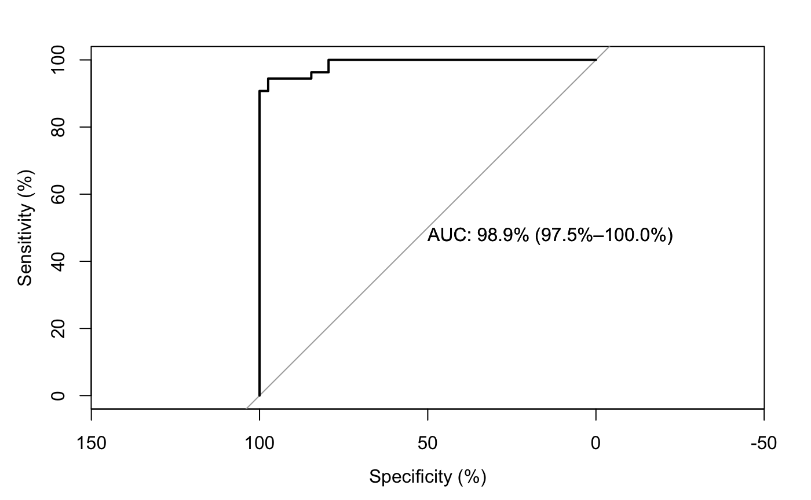

The second model with the log transformation have the AUC score of 98.53%, the F-1 Score of 0.9216 and the accuracy of 0.914. Compared to the first model, this is an unexpected result. All metric from the second model slightly deteriorated.


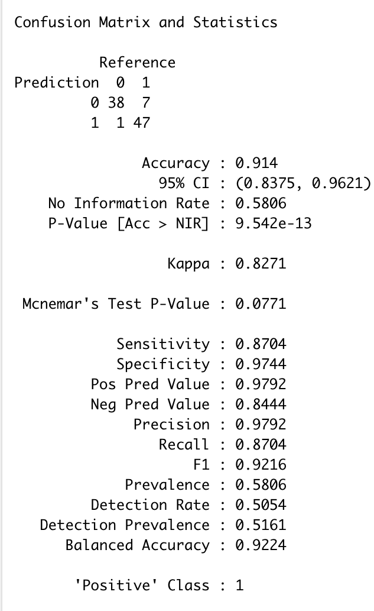


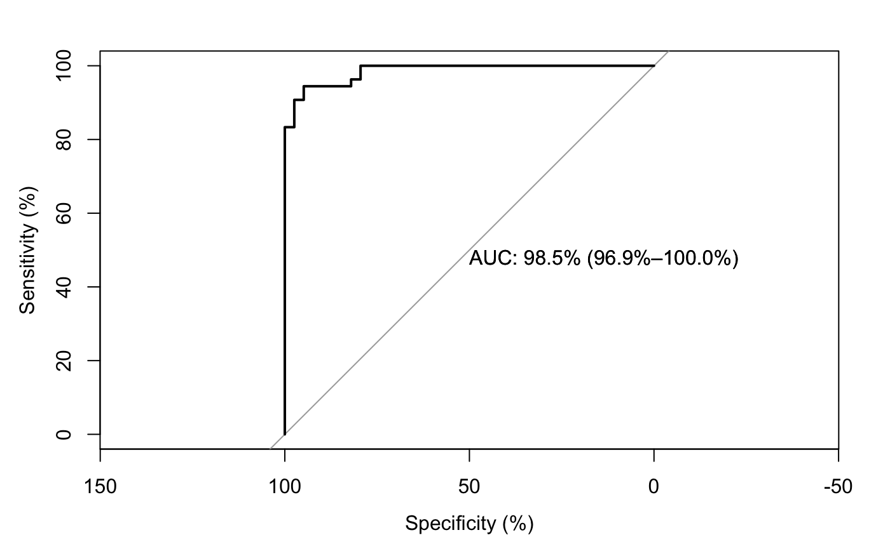

The third model with `tax` variable removed slightly deteriorated compared to the first model. The AUC for that model is 98.67, the accuracy is 0.9355 and the F-1 Score is 0.9268.

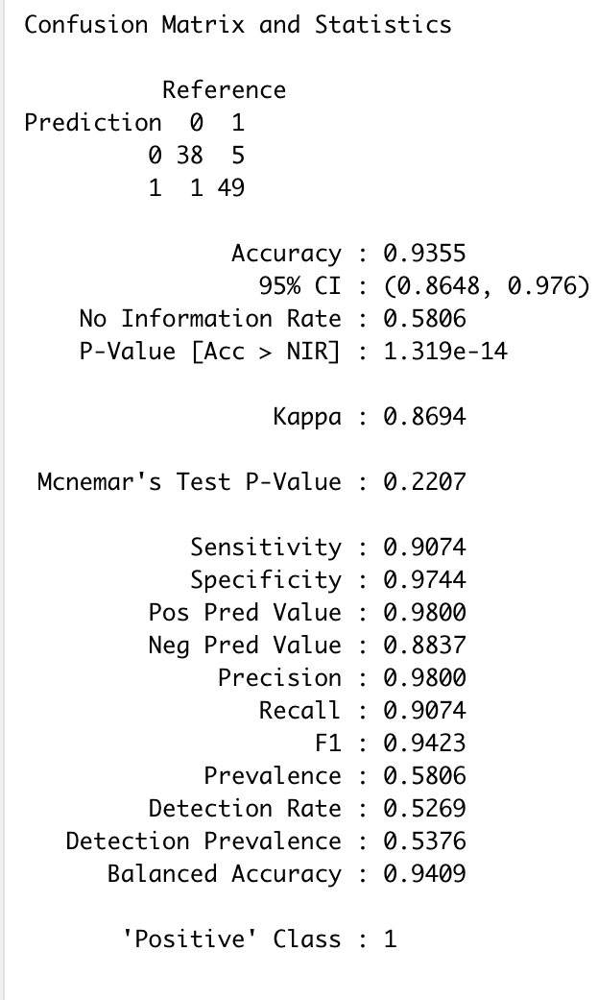


The last model with all outliers removed have the worst result from all metrics. The F-1 Score is 0.6000, the accuracy is 0.8261 an the AUC is 92.72%, making the model with the worst performance.


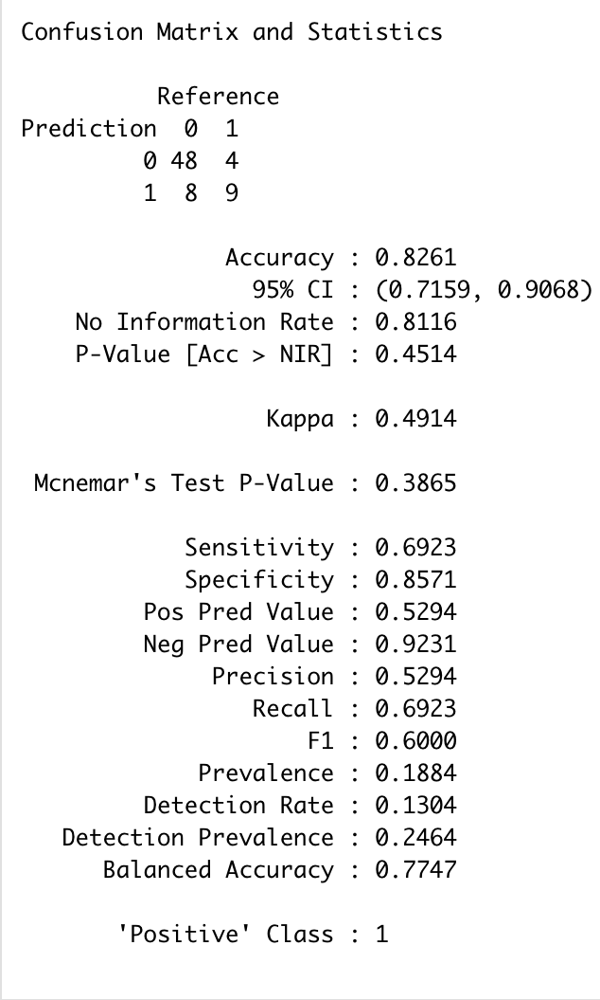


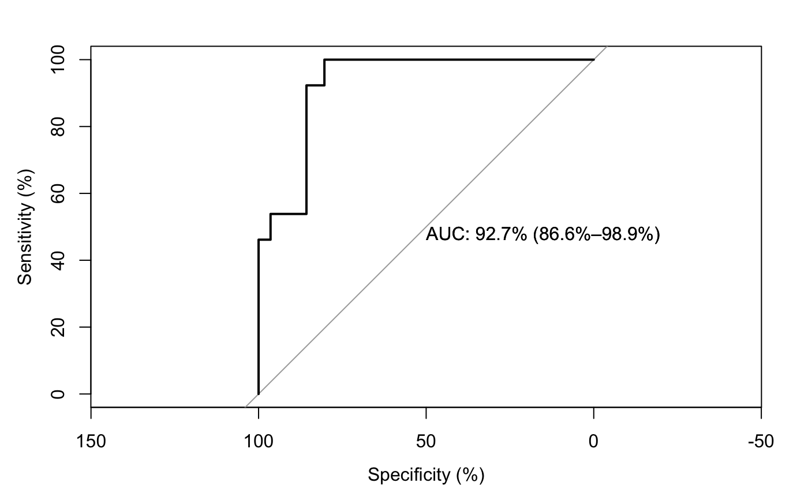

Out of all models, we decided to select the second model with the log transformation. Both first and third models have better performance and metric results than the second model, but the data used in those models have outliers, which can impact the model's prediction and making it harder to generalize the result. This could lead to unreliable predictions.

# Appendix

```{r ref.label=knitr::all_labels(), echo=TRUE, eval=FALSE}
##  Data Exploration
# pull in the training data set
crime_training_data <- read.csv("https://raw.githubusercontent.com/eddiexunyc/crime_binary_logistic_regression/refs/heads/main/Resources/crime-training-data_modified.csv")

# pull in the test data
crime_test_data <- read.csv("https://raw.githubusercontent.com/eddiexunyc/crime_binary_logistic_regression/refs/heads/main/Resources/crime-evaluation-data_modified.csv")

glimpse(crime_training_data)

introduce(crime_training_data)

# par on plots
par(mfrow = c(1, 4))
plot_intro(crime_training_data)
describeBy(crime_training_data)
plot_histogram(crime_training_data)

# boxplot on variables
crime_box_plot <- crime_training_data %>%
  gather(key, value, -target) %>% 
  mutate(key = factor(key),
         target = factor(target)) %>% 
  ggplot(aes(x = key, y = value)) +
  geom_boxplot(aes(fill = target)) +
  facet_wrap(~ key, scales = 'free', ncol = 4) +
  scale_fill_manual(values=c("lightblue", "pink")) +
  coord_flip() +
  theme_minimal()

# correlation plot on variables
par(mfrow = c(1,2))
crime_box_plot
corPlot(crime_training_data, upper = FALSE)

# fit a linear regression before VIF score
vif_model_all <- lm(target ~ ., data = crime_training_data)

summary(vif_model_all)

# perform VIF
vif_value = vif(vif_model_all)
vif_value

# tax removed
crime_training_data_tax_removed <- crime_training_data %>%
  dplyr::select(-c(tax))
vif_model_tax <- lm(target ~., data = crime_training_data_tax_removed)
vif2_score <- vif(vif_model_tax)

# rad removed
crime_training_data_rad_removed <- crime_training_data %>%
  dplyr::select(-c(rad))
vif_model_rad <- lm(target ~., data = crime_training_data_rad_removed)
vif3_score <- vif(vif_model_rad)

# print score
vif2_score
vif3_score

## Data Preparation
# perform a log transformation on rad and dis variables
crime_training_data_transformed <- crime_training_data %>%
  mutate(age_log = log(crime_training_data$age + 1),
         dis_log = log(crime_training_data$dis + 1),
         lstat_log = log(crime_training_data$lstat + 1),
         indus_log = log(crime_training_data$indus + 1),
         tax_log = log(crime_training_data$tax + 1),
         rad_log = log(crime_training_data$rad + 1)) %>%
  select(-c(age, dis, lstat, indus, tax, rad))

# remove the skewed variables
crime_training_data_updated <- crime_training_data %>%
  filter(crime_training_data$rad != 24)

head(crime_training_data_updated)

## Build Model

### Model 1
# set seed
set.seed(123)

# build the binary logistic regression model 1
crime_binary_model_1 <- glm(crime_training_data, family = 'binomial', formula = target ~.)
summary(crime_binary_model_1)
plot(crime_binary_model_1)

### Model 2
# set seed
set.seed(123)

crime_binary_model_2 <- glm(crime_training_data_transformed, family = 'binomial', formula = target ~.)
summary(crime_binary_model_2)
plot(crime_binary_model_2)

### Model 3
# set seed
set.seed(123)

crime_binary_model_3 <- glm(crime_training_data_tax_removed, family = 'binomial', formula = target ~.)
summary(crime_binary_model_3)
plot(crime_binary_model_3)

### Model 4
# set seed
set.seed(123)

crime_binary_model_4 <- glm(crime_training_data_updated, family = 'binomial', formula = target ~.)
summary(crime_binary_model_4)
plot(crime_binary_model_4)

## Select Model
### Model 1 Assessment
# set seed
set.seed(123)

data_split_model_1 <- createDataPartition(y = crime_training_data$target, p = 0.8, list = FALSE)
crime_train_data_model_1 <- crime_training_data[data_split_model_1,]
crime_test_data_model_1 <- crime_training_data[-data_split_model_1,]
crime_binary_test_model_1 <- glm(crime_train_data_model_1, family = 'binomial', formula = target ~.)
crime_binary_prediction_1 <- predict(crime_binary_test_model_1, crime_test_data_model_1, type = "response")
crime_predicted_class_1 <- ifelse(crime_binary_prediction_1 > 0.5, 1, 0)
crime_confusion_matrix_1 <- confusionMatrix(data = as.factor(crime_predicted_class_1), reference = as.factor(crime_test_data_model_1$target), mode = "everything", positive = "1")

print(crime_confusion_matrix_1)

# set seed
set.seed(123)

roc(crime_test_data_model_1$target, crime_binary_prediction_1 , percent=TRUE, plot=TRUE, ci=TRUE, print.auc = TRUE)

### Model 2 Assessment 
# set seed
set.seed(123)

data_split_model_2 <- createDataPartition(y = crime_training_data_transformed$target, p = 0.8, list = FALSE)
crime_train_data_model_2 <- crime_training_data_transformed[data_split_model_2,]
crime_test_data_model_2 <- crime_training_data_transformed[-data_split_model_2,]
crime_binary_test_model_2 <- glm(crime_train_data_model_2, family = 'binomial', formula = target ~.)
crime_binary_prediction_2 <- predict(crime_binary_test_model_2, crime_test_data_model_2, type = "response")
crime_predicted_class_2 <- ifelse(crime_binary_prediction_2 > 0.5, 1, 0)
crime_confusion_matrix_2 <- confusionMatrix(data = as.factor(crime_predicted_class_2), reference = as.factor(crime_test_data_model_2$target), mode = "everything", positive = "1")

print(crime_confusion_matrix_2)

# set seed
set.seed(123)

roc(crime_test_data_model_2$target, crime_binary_prediction_2, percent=TRUE, plot=TRUE, ci=TRUE, print.auc = TRUE)

### Model 3 Assessment
# set seed
set.seed(123)

data_split_model_3 <- createDataPartition(y = crime_training_data_tax_removed$target, p = 0.8, list = FALSE)
crime_train_data_model_3 <- crime_training_data_tax_removed[data_split_model_3,]
crime_test_data_model_3 <- crime_training_data_tax_removed[-data_split_model_3,]
crime_binary_test_model_3 <- glm(crime_train_data_model_3, family = 'binomial', formula = target ~.)
crime_binary_prediction_3 <- predict(crime_binary_test_model_3, crime_test_data_model_3, type = "response")
crime_predicted_class_3 <- ifelse(crime_binary_prediction_3 > 0.5, 1, 0)
crime_confusion_matrix_3 <- confusionMatrix(data = as.factor(crime_predicted_class_3), reference = as.factor(crime_test_data_model_3$target), mode = "everything", positive = "1")

print(crime_confusion_matrix_3)

# set seed
set.seed(123)

roc(crime_test_data_model_3$target, crime_binary_prediction_3, percent=TRUE, plot=TRUE, ci=TRUE, print.auc = TRUE)

### Model 4 Assessment
# set seed
set.seed(123)

data_split_model_4 <- createDataPartition(y = crime_training_data_updated$target, p = 0.8, list = FALSE)
crime_train_data_model_4 <- crime_training_data_updated[data_split_model_4,]
crime_test_data_model_4 <- crime_training_data_updated[-data_split_model_4,]
crime_binary_test_model_4 <- glm(crime_train_data_model_4, family = 'binomial', formula = target ~.)
crime_binary_prediction_4 <- predict(crime_binary_test_model_4, crime_test_data_model_4, type = "response")
crime_predicted_class_4 <- ifelse(crime_binary_prediction_4 > 0.5, 1, 0)
crime_confusion_matrix_4 <- confusionMatrix(data = as.factor(crime_predicted_class_4), reference = as.factor(crime_test_data_model_4$target), mode = "everything", positive = "1")

print(crime_confusion_matrix_4)

# set seed
set.seed(123)

roc(crime_test_data_model_4$target, crime_binary_prediction_4, percent=TRUE, plot=TRUE, ci=TRUE, print.auc = TRUE)

# transform the test data to reflect the transformed training data used earlier
crime_test_data_transformed <- crime_test_data %>%
  mutate(age_log = log(crime_test_data$age + 1),
         dis_log = log(crime_test_data$dis + 1),
         lstat_log = log(crime_test_data$lstat + 1),
         indus_log = log(crime_test_data$indus + 1),
         tax_log = log(crime_test_data$tax + 1),
         rad_log = log(crime_test_data$rad + 1)) %>%
  select(-c(age, dis, lstat, indus, tax, rad))

# prediction on test transformed data
crime_test_prediction <- predict(crime_binary_test_model_2, crime_test_data_transformed, type = "response")
crime_prediction_class <- as.factor(ifelse(crime_test_prediction > 0.5, 1, 0))

# output the prediction to csv
write.table(crime_test_prediction, file = "crime_test_prediction.csv", sep = ",", qmethod = "double", row.names=FALSE)
write.table(crime_prediction_class, file = "crime_prediction_class.csv", sep = ",", qmethod = "double", row.names=FALSE)
```

